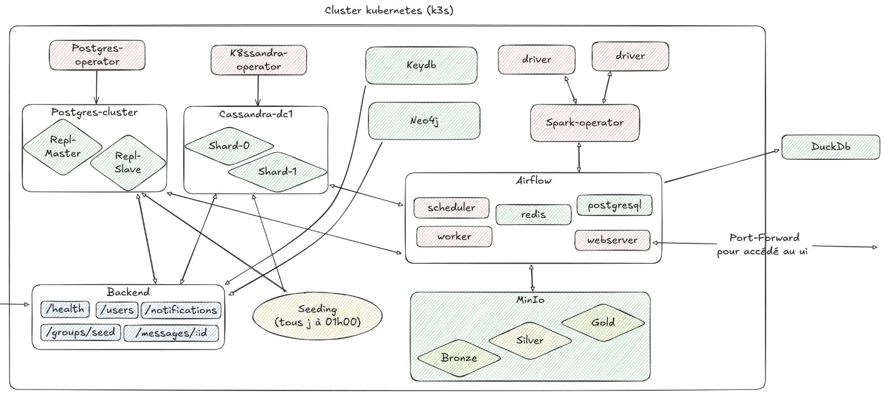
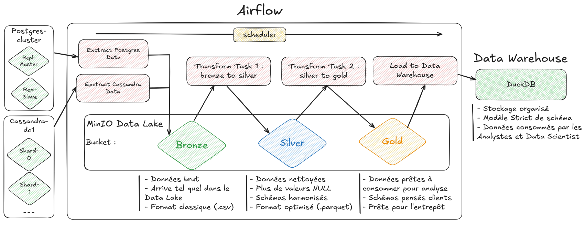
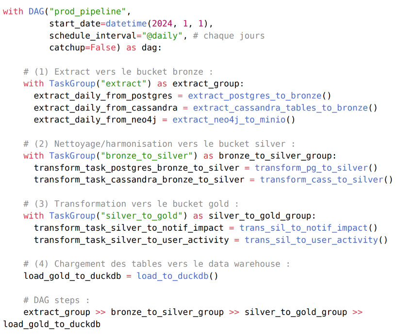

# Distributed Data Architecture - Engineering School Project

This repository contains the source code and configuration files for a distributed data management and processing architecture. It was developed as part of our fourth-year engineering studies at Junia ISEN, in the Big Data specialization.

## Table of Contents
1. [Project Overview](#project-overview)
2. [Architecture Summary](#architecture-summary)
3. [Data Pipeline (ELT)](#data-pipeline-elt)
4. [Backend System](#backend-system)
    - [API Endpoints Overview](#api-endpoints-overview)
        - [PostgreSQL](#postgresql-via-typeorm)
        - [Cassandra](#cassandra-via-cassandra-driver)
        - [MinIO](#minio-s3-compatible-storage)
5. [Folder Descriptions](#folder-descriptions)
6. [Summary Of The Technologies Used](#summary-of-the-technologies-used)
7. [Getting Started](#getting-started)
    - [Prerequisites](#prerequisites)
    - [Installation](#installation)
    - [Deployment](#deployment)
    - [Usage](#usage)
8. [Features](#features)
9. [Future Improvements](#future-improvements)
10. [Known Challenges](#known-challenges)
11. [Fully Described Documentation](#documentation)
12. [Authors](#authors)


## Project Overview

This project represents a comprehensive implementation of modern distributed data architecture, developed as part of the fourth-year engineering curriculum at Junia ISEN's Big Data specialization. The goal was to transform a simple web application's backend and storage system into a scalable, production-grade data architecture, capable of handling large-scale data ingestion, processing, and analytics.

We built a modern distributed system using industry-standard tools to:

- Ensure horizontal scalability and resilience through Kubernetes orchestration
- Orchestrate multiple services in a fully containerized microservices environment
- Process and transform large volumes of data using Apache Spark and Python-based ETL
- Support analytical and decision-making use cases with a modern medallion architecture
- Implement polyglot persistence with specialized databases for different data models
- Enable real-time caching and object storage capabilities

## Architecture Summary



Our infrastructure implements a complete data ecosystem with the following components:

### Core Infrastructure
- **Kubernetes (K3s)** - Lightweight container orchestration for edge and development environments
- **Helm** - Package manager for Kubernetes, enabling declarative and reproducible deployments

### Data Storage Layer (Polyglot Persistence)
- **PostgreSQL** (v16-Alpine) - Primary relational database for structured user and group data
- **Cassandra** - Wide-column NoSQL database for high-throughput message and notification storage
- **Neo4j** - Graph database for managing complex relationship networks between users
- **KeyDB/Redis** (v7-Alpine) - In-memory data structure store for distributed caching
- **MinIO** - S3-compatible object storage for data lake implementation

### Data Processing & Analytics
- **Apache Spark** - Distributed processing engine for large-scale data transformations
- **Apache Airflow** - Workflow orchestration platform for managing complex DAGs
- **DuckDB** - Embedded analytical database for OLAP workloads
- **Pandas & PySpark** - Python libraries for data manipulation and processing

### Application Layer
- **NestJS** - Modern Node.js framework for building scalable backend APIs
- **TypeORM** - ORM for PostgreSQL integration
- **Native drivers** - Direct integration with Cassandra, Neo4j, and Redis

Each service is deployed in containers and managed via Helm charts within the Kubernetes cluster, ensuring consistent deployments and easy scalability.

## Data Pipeline (ELT)



The data pipeline implements a **medallion architecture** for progressive data refinement:

### Data Layers

1. **Bronze Layer (Raw Data)**
   - Daily extraction from operational databases (PostgreSQL, Cassandra, Neo4j)
   - Raw data stored in MinIO buckets with date partitioning
   - Preserves original data format for audit and reprocessing capabilities

2. **Silver Layer (Cleaned & Standardized)**
   - Data cleansing and type harmonization
   - Conversion to Parquet format for efficient storage and querying
   - Schema validation and data quality checks
   - Deduplication and handling of missing values

3. **Gold Layer (Business-Ready)**
   - Aggregated metrics and KPIs
   - User activity analysis tables
   - Notification impact assessment
   - Optimized for analytical queries and reporting

### Pipeline Implementation



The pipeline is orchestrated through Apache Airflow with the following key components:

- **Extract Tasks**: Parallel extraction from multiple data sources
- **Transform Tasks**: Bronze-to-Silver and Silver-to-Gold transformations
- **Load Tasks**: Final loading into DuckDB data warehouse

### Daily Processing Schedule
- Runs automatically at midnight (UTC)
- Processes previous day's data
- Includes error handling and retry mechanisms
- Supports backfilling for historical data processing

## Backend System

The backend system is built with NestJS and implements a modular architecture with separate modules for each database integration. It provides a unified REST API for interacting with the distributed storage systems.

### Key Features
- **Modular Architecture**: Separate modules for each database with dedicated providers and services
- **Dependency Injection**: Leveraging NestJS's powerful DI container for clean code organization
- **Type Safety**: Full TypeScript implementation with DTOs and entities
- **Mock Data Generation**: Comprehensive scripts using Faker.js for testing at scale
- **File Storage**: Integration with MinIO for object storage operations
- **Caching Layer**: Redis integration for performance optimization

### API Endpoints Overview

#### PostgreSQL (via TypeORM)
- **GET** `http://localhost:3000/users` - Retrieve the list of users.
- **GET** `http://localhost:3000/users/:id` - Retrieve a user by ID.
- **POST** `http://localhost:3000/users` - Create a new user.
- **GET** `http://localhost:3000/groups` - Retrieve the list of groups.
- **GET** `http://localhost:3000/groups/:id` - Retrieve a group by ID.
- **POST** `http://localhost:3000/groups` - Create a new group.

#### Cassandra (via cassandra-driver)
- **GET** `http://localhost:3000/messages/:conversationId` - Retrieve messages from a conversation.
- **POST** `http://localhost:3000/messages` - Insert a new message.
- **GET** `http://localhost:3000/notifications/:userId` - Retrieve notifications for a user.
- **POST** `http://localhost:3000/notifications` - Insert a new notification.

#### MinIO (S3-Compatible Storage)

- **POST** `http://localhost:3000/storage/upload`  
    Upload a file using the `file` field in form-data.

- **GET** `http://localhost:3000/storage/download/:filename`  
    Download a file by specifying the filename in the URL.  
    Example: `http://localhost:3000/storage/download/test-image.png`

## Component Descriptions

### Detailed Component Descriptions

#### Backend Components

- **config/**: Database configuration modules using NestJS ConfigModule for environment-based settings
- **controllers/**: RESTful API endpoints with validation and error handling
  - User management (CRUD operations)
  - Message handling with conversation threading
  - Notification delivery system
  - Group management functionality
  - File upload/download operations

- **databases/**: Database-specific connection providers and modules
  - Each database has its own module for isolation
  - Connection pooling and health checks
  - Retry mechanisms for resilience

- **models/**: Data models and entities
  - TypeORM entities for PostgreSQL
  - Cassandra table definitions
  - Neo4j node and relationship models

- **services/**: Business logic layer
  - Data validation and transformation
  - Cross-database operations
  - Cache management strategies
  - File storage operations with MinIO

- **scripts/**: Testing and data generation utilities
  - Faker.js integration for realistic test data
  - Bulk data insertion for performance testing
  - Database seeding scripts

- **shared/**: Common code and interfaces
  - DTOs with class-validator decorators
  - Generic interfaces for CRUD operations
  - Utility functions and helpers

#### Pipeline Components

- **workflows/**: Airflow DAG definitions
  - Production pipeline with daily scheduling
  - POC pipeline for testing new features
  - Modular task organization

- **prod_pipeline/**: Production-ready transformation modules
  - Extract modules for each data source
  - Bronze-to-silver transformation logic
  - Silver-to-gold aggregation functions
  - DuckDB loading procedures

- **proof_of_concept/**: Experimental pipeline features
  - Spark job definitions
  - Test transformations
  - Performance benchmarking


## Technology Stack

### Programming Languages
- **TypeScript/JavaScript**: Backend API development with type safety
- **Python 3.10+**: Data pipeline and transformation scripts
- **SQL**: Database queries and DuckDB analytics
- **Cypher**: Neo4j graph queries
- **YAML**: Configuration and Helm charts

### Backend Technologies
- **NestJS v11**: Enterprise-grade Node.js framework
- **TypeORM v0.3**: Object-relational mapping for PostgreSQL
- **Express**: HTTP server framework
- **Class-validator**: Request validation
- **Faker.js**: Test data generation

### Databases & Storage
- **PostgreSQL v16**: ACID-compliant relational database
- **Apache Cassandra v4+**: Distributed NoSQL database
- **Neo4j v5+**: Native graph database
- **Redis/KeyDB v7**: In-memory caching
- **MinIO**: S3-compatible object storage
- **DuckDB**: Embedded OLAP database

### Data Processing
- **Apache Airflow**: Workflow orchestration
- **Apache Spark**: Distributed data processing
- **Pandas**: Data manipulation in Python
- **PySpark**: Python API for Spark
- **Parquet**: Columnar storage format

### Infrastructure & DevOps
- **Kubernetes (K3s)**: Container orchestration
- **Helm v3**: Kubernetes package management
- **Docker**: Containerization
- **Docker Compose**: Local development environment

## Getting Started

### Prerequisites

#### Required Software
- Docker Desktop or Docker Engine (v20.10+)
- kubectl (v1.25+)
- Helm (v3.10+)
- Node.js (v18+) and npm
- Python (v3.10+)
- Git

#### Optional (for Kubernetes deployment)
- k3s, minikube, or any Kubernetes cluster
- Storage provisioner for persistent volumes

### Installation

#### 1. Clone the Repository
```bash
git clone https://github.com/your-org/projetm1git.git
cd projetm1git
```

#### 2. Local Development Setup (Docker Compose)

```bash
# Navigate to backend directory
cd backend-distributed-api

# Copy environment template
cp .env.example .env

# Edit .env with your configurations
# Required variables:
# - DATABASE_* (PostgreSQL settings)
# - NEO4J_* (Neo4j credentials)
# - STORAGE_* (MinIO access keys)
# - REDIS_* (Redis connection)

# Start all services
docker-compose up -d

# Install dependencies
npm install

# Run database migrations
npm run migration:run

# Start the backend in development mode
npm run start:dev
```

#### 3. Generate Test Data
```bash
# Generate mock data for all databases
npm run script:generate-postgres
npm run script:generate-cassandra
npm run script:generate-neo4j
```

### Kubernetes Deployment

#### 1. Create Namespace
```bash
kubectl create namespace data-platform
```

#### 2. Deploy Infrastructure Components
```bash
# Deploy PostgreSQL
helm install postgres ./postgresql -n data-platform

# Deploy Cassandra
helm install cassandra ./helms/cassandra -n data-platform

# Deploy MinIO
helm install minio ./pipeline/helms/minio-chart -n data-platform

# Deploy Airflow
helm install airflow ./pipeline/helms/airflow -n data-platform

# Deploy Spark Operator
helm install spark ./pipeline/helms/spark -n data-platform
```

#### 3. Deploy Backend Application
```bash
helm install backend ./backend-chart -n data-platform \
  --set image.tag=latest \
  --set ingress.enabled=true \
  --set ingress.host=api.yourdomain.com
```

### Usage

#### Accessing Services

**Local Development:**
- Backend API: http://localhost:3000
- PostgreSQL: localhost:5432
- Neo4j Browser: http://localhost:7474
- MinIO Console: http://localhost:9001
- Redis: localhost:6379

**Kubernetes:**
- Use `kubectl port-forward` or configure Ingress
- Airflow UI: `kubectl port-forward svc/airflow-webserver 8080:8080 -n data-platform`
- MinIO: `kubectl port-forward svc/minio 9000:9000 9001:9001 -n data-platform`

#### Running Data Pipelines

1. Access Airflow UI
2. Enable the `prod_pipeline` DAG
3. Trigger manual run or wait for scheduled execution
4. Monitor task progress in the Graph view

#### Querying Analytics Data

```python
# Connect to DuckDB
import duckdb

conn = duckdb.connect('/path/to/analytics.duckdb')

# Query user activity
result = conn.execute("""
    SELECT * FROM gold.user_activity 
    WHERE date >= '2024-01-01'
    ORDER BY total_messages DESC
""").fetchall()
```


## Features

### Infrastructure & Architecture
- **Cloud-Native Design**: Fully containerized microservices running on Kubernetes
- **Declarative Infrastructure**: All deployments managed through Helm charts and GitOps
- **Horizontal Scalability**: Auto-scaling capabilities for API and processing workloads
- **High Availability**: Multi-replica deployments with health checks and automatic recovery
- **Service Mesh Ready**: Prepared for Istio/Linkerd integration

### Data Management
- **Polyglot Persistence**: Optimized storage for different data models
  - Relational data in PostgreSQL
  - Time-series and high-write data in Cassandra
  - Graph relationships in Neo4j
  - Binary objects in MinIO
- **Data Lake Architecture**: Bronze/Silver/Gold medallion pattern
- **ACID Compliance**: Transaction support where needed
- **Eventually Consistent**: Cassandra for high-throughput scenarios

### Data Processing & Analytics
- **Automated ELT Pipeline**: Daily batch processing with Airflow
- **Distributed Processing**: Apache Spark for large-scale transformations
- **Real-time Caching**: Redis for frequently accessed data
- **OLAP Analytics**: DuckDB for complex analytical queries
- **Data Quality Checks**: Validation at each pipeline stage

### Development & Operations
- **Type-Safe Backend**: Full TypeScript with NestJS
- **API Documentation**: Auto-generated OpenAPI/Swagger specs
- **Mock Data Generation**: Comprehensive testing with realistic data
- **Container Orchestration**: Kubernetes-native deployment
- **Monitoring Ready**: Prometheus metrics endpoints
- **Log Aggregation**: Structured logging for debugging

## Future Improvements

### Short-term Roadmap
- **API Gateway**: Kong or Traefik for unified API management
- **Service Mesh**: Istio integration for advanced traffic management
- **Monitoring Stack**: Prometheus + Grafana dashboards
- **CI/CD Pipeline**: GitLab CI or GitHub Actions for automated deployments
- **API Rate Limiting**: Protect services from overload
- **WebSocket Support**: Real-time notifications and updates

### Medium-term Enhancements
- **Stream Processing**: Apache Kafka for real-time data ingestion
- **Change Data Capture**: Debezium for database event streaming
- **Data Quality Framework**: Great Expectations integration
- **Advanced Neo4j Features**:
  - Graph algorithms (PageRank, community detection)
  - Recommendation engine
  - Fraud detection patterns
- **Multi-datacenter Support**: 
  - Cassandra cross-DC replication
  - Global load balancing
  - Disaster recovery setup

### Long-term Vision
- **Machine Learning Pipeline**:
  - MLflow for experiment tracking
  - Feature store implementation
  - Model serving with KServe
- **Data Governance**:
  - Apache Atlas for metadata management
  - Data lineage tracking
  - GDPR compliance tools
- **Advanced Analytics**:
  - Apache Superset for visualization
  - Jupyter Hub for data science
  - Apache Druid for real-time analytics
- **Security Enhancements**:
  - OAuth2/OIDC authentication
  - End-to-end encryption
  - Audit logging and compliance

## Known Challenges & Solutions

### Current Limitations

#### Infrastructure Complexity
- **Challenge**: Kubernetes configuration requires significant expertise
- **Solution**: Comprehensive Helm charts with sensible defaults
- **Workaround**: Docker Compose for local development

#### Cassandra Performance
- **Challenge**: Resource-intensive for development environments
- **Solution**: Tuned JVM settings for smaller deployments
- **Recommendation**: Use single-node for testing, 3+ nodes for production

#### Spark Operator
- **Challenge**: Complex RBAC and resource management
- **Solution**: Pre-configured service accounts and resource limits
- **Alternative**: Use local Spark for development

### Performance Considerations
- **Memory Requirements**: Minimum 16GB RAM for full local deployment
- **Storage**: 50GB+ for data lake and database volumes
- **Network**: Low-latency required between Cassandra nodes

### Troubleshooting Guide

#### Common Issues
1. **Pod CrashLoopBackOff**: Check resource limits and database connections
2. **Persistent Volume Claims**: Ensure storage class is available
3. **Service Discovery**: Verify DNS resolution in cluster
4. **Airflow Task Failures**: Check executor logs and resource allocation

#### Debug Commands
```bash
# Check pod status
kubectl get pods -n data-platform

# View logs
kubectl logs -f <pod-name> -n data-platform

# Describe pod for events
kubectl describe pod <pod-name> -n data-platform

# Access pod shell
kubectl exec -it <pod-name> -n data-platform -- /bin/bash
```

## Documentation & Resources

### Project Documentation
- **Final Report**: [Complete Project Report (French)](./Rapport%20Final.pdf)
- **Presentation Slides**: [Project Presentation (French)](./Presentation_Projet.pdf)
- **API Documentation**: Available at `/api/docs` when backend is running
- **Pipeline Documentation**: See [pipeline/README.md](./pipeline/README.md)
- **Backend Setup**: See [backend-distributed-api/README.md](./backend-distributed-api/README.md)

### Architecture Diagrams
- **Global Architecture**: [pictures/global_architecture.png](./pictures/global_architecture.png)
- **ELT Pipeline Flow**: [pictures/elt_pipeline.png](./pictures/elt_pipeline.png)
- **Main DAG Structure**: [pictures/main_dag.png](./pictures/main_dag.png)

### External Resources
- [NestJS Documentation](https://docs.nestjs.com/)
- [Apache Airflow Guides](https://airflow.apache.org/docs/)
- [Kubernetes Documentation](https://kubernetes.io/docs/)
- [Helm Chart Development](https://helm.sh/docs/)
- [DuckDB SQL Reference](https://duckdb.org/docs/)

### Performance Benchmarks
- PostgreSQL: ~10K transactions/second
- Cassandra: ~50K writes/second
- MinIO: ~1GB/s throughput
- Pipeline Processing: ~100GB/day capacity

## Authors

- Cyprien Kelma
- Nathan Eudeline  
- Nolan Cacheux
- Paul Pousset  
- Mamoun Kabbaj  

## License & Acknowledgments

### License
This project is developed for educational purposes as part of the engineering curriculum at Junia ISEN. 

### Acknowledgments
- **Institution**: Junia ISEN, Lille, France
- **Program**: Fourth-year Engineering, Big Data Specialization
- **Academic Year**: 2024-2025

### Contact
For questions or collaboration:
- Create an issue in this repository
- Contact via institutional email addresses

---

**Copyright © 2025 - Junia ISEN – Big Data Specialization**  
*This project is for educational and demonstration purposes only.*  
*Not intended for production use without proper security hardening and testing.*